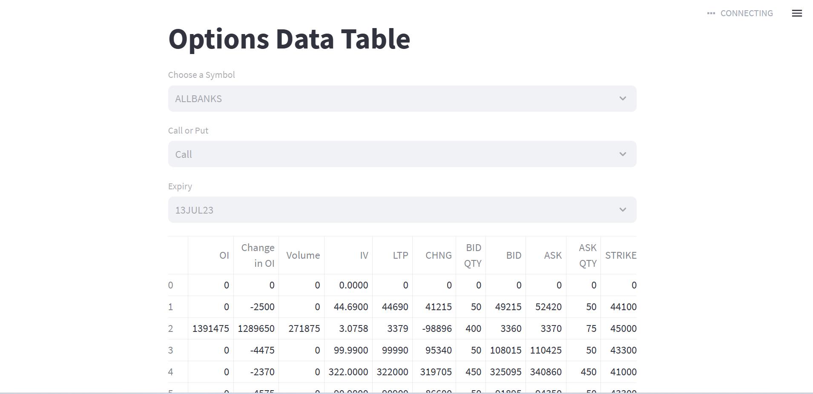
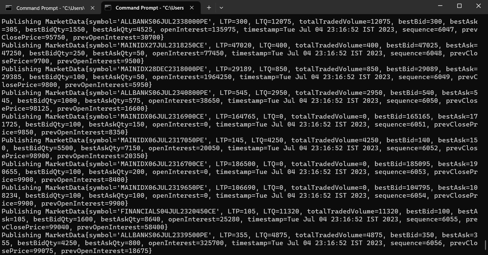
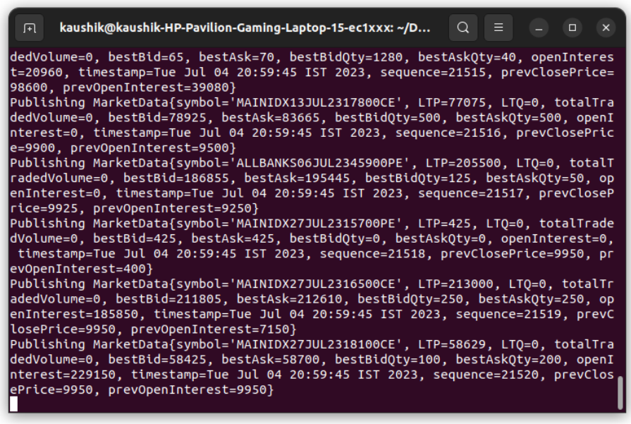
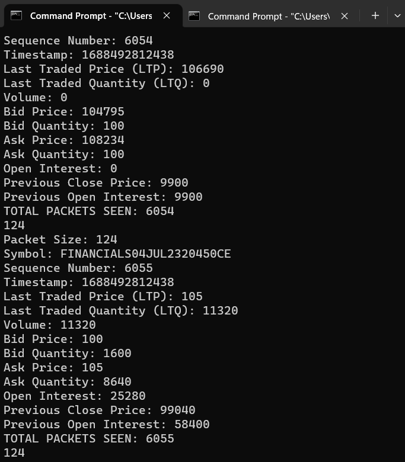
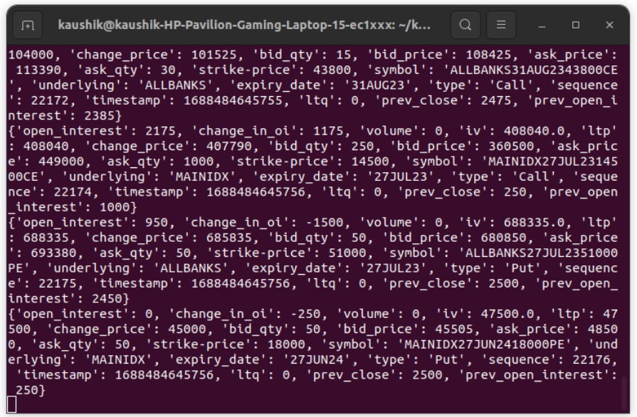

# Demonstration Video 

https://clipchamp.com/watch/9bxmAON3BO8

# Project Setup Guide (Windows)

Follow the steps below to set up the project on a Windows system:

## 1. Download and Unzip Apache Kafka
Download Apache Kafka from the official website (https://kafka.apache.org/downloads) and unzip the downloaded file to a preferred location on your system.

## 2. Run ZooKeeper Server and Kafka Server
Open a command prompt and navigate to the Kafka directory. Run the following commands to start the ZooKeeper server and Kafka server respectively:

```shell
bin\windows\zookeeper-server-start.bat config\zookeeper.properties
bin\windows\kafka-server-start.bat config\server.properties
```

## 3. Ensure Java is Installed
Make sure you have Java Development Kit (JDK) version 11 or higher installed on your system. You can download the JDK from the official Oracle website (https://www.oracle.com/java/technologies/javase-jdk11-downloads.html).

## 4. Run the Java Application
Open another command prompt and navigate to the directory where the Java application is located. Run the following command to start the application:

```shell
java -Ddebug=true -Dspeed=1.0 -classpath feed-play-1.0.jar hackathon.player.Main dataset.csv 9011
```

## 5. Run the Python Script
Open a new command prompt and navigate to the directory where the Python script is located. Run the following command to execute the script:

```shell
python test.py
```

## 6. Launch the Streamlit Interface
Open another command prompt and navigate to the project directory. Run the following command to start the Streamlit interface:

```shell
streamlit run interface.py
```

Following these steps will set up the project and allow you to run the Apache Kafka servers, execute the Java application, run the Python script, and launch the Streamlit interface on your Windows system.

# Implementation Images 

## 1. User Interface



## 2. Incoming Data Stream 





## 3. Consuming Data from Kafka Stream




